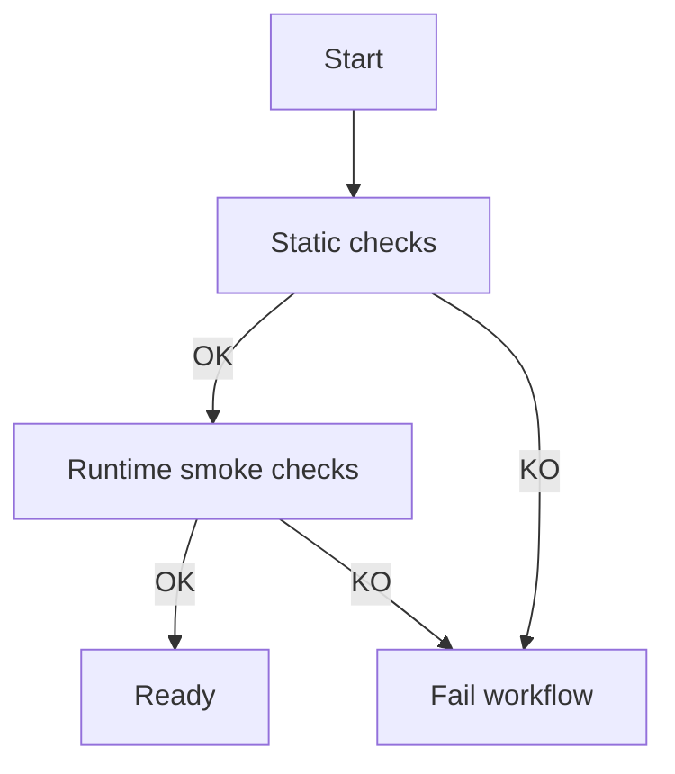

# Audela Credit Argo Workflow

This folder contains an Argo-based visual workflow to validate Audela Credit readiness.

## Files

- `credit-readiness-workflow.yaml`
  - `Workflow` for on-demand checks
  - `CronWorkflow` for daily checks at `05:00 UTC`

## What is validated

The workflow executes:

1. Static checks (`--mode static`)
2. Runtime smoke checks (`--mode smoke`)

Both are implemented in `validate_credit_readiness.py` at repo root.

## Run manually

```bash
kubectl apply -f argo/credit-readiness-workflow.yaml
argo submit argo/credit-readiness-workflow.yaml --entrypoint credit-readiness
```

If you run outside Argo:

```bash
/home/testuser/audela_flask_website/.venv/bin/python validate_credit_readiness.py --mode all
```

## Visual flow (Mermaid)


